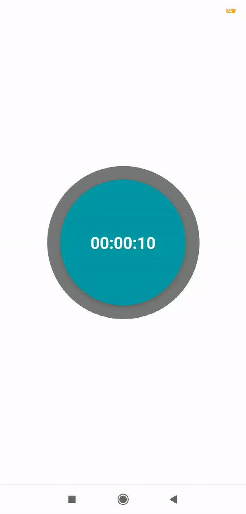

# React Native Pie Count Down

<div style="margin: 0 auto; width: 200px; height: auto;">



</div>

## Example

```typescript
import React from "react";
import { StyleSheet, Text, View } from "react-native";
import { PieCountDown } from "react-native-piecountdown";

export default class App extends React.Component {
  render() {
    return (
      <View style={styles.container}>
        <PieCountDown time={10}></PieCountDown>
      </View>
    );
  }
}

const styles = StyleSheet.create({
  container: {
    flex: 1,
    backgroundColor: '#fff',
    alignItems: 'center',
    justifyContent: 'center',
  },
});

```

## Events

### onPieCountDownUpdate: Object

Return the following object.

```typescript
{
  time: number,
  toString: string
}
```

### onPieCountDownFinished: void

Return nothing.

```typescript
```

## Todo

[x] Add animations to the circle

[ ] Allow color change

[ ]

## Author

Guillaume Quittet
